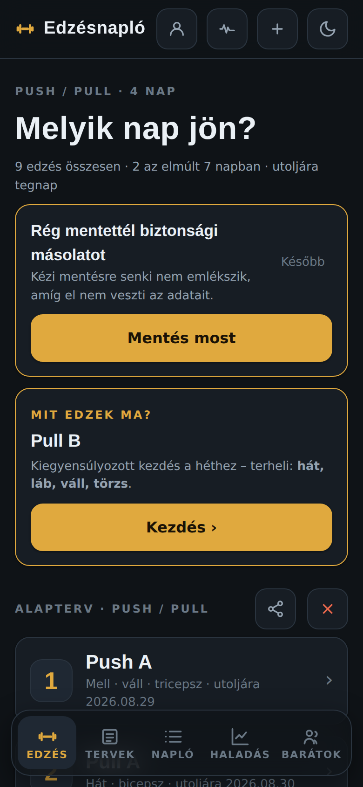
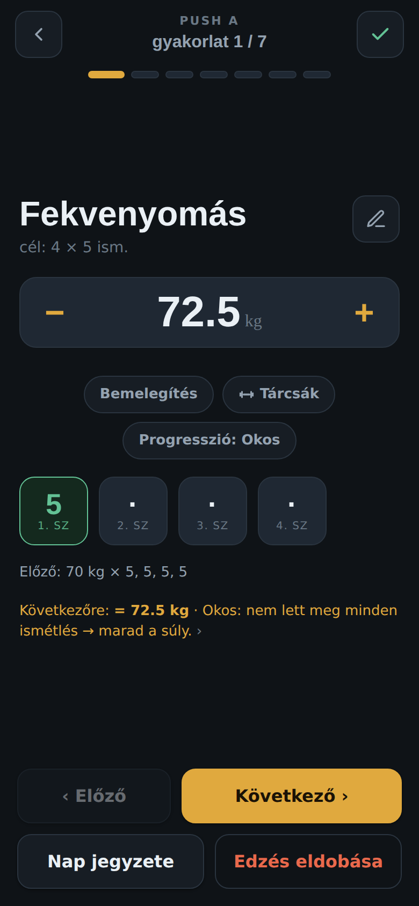
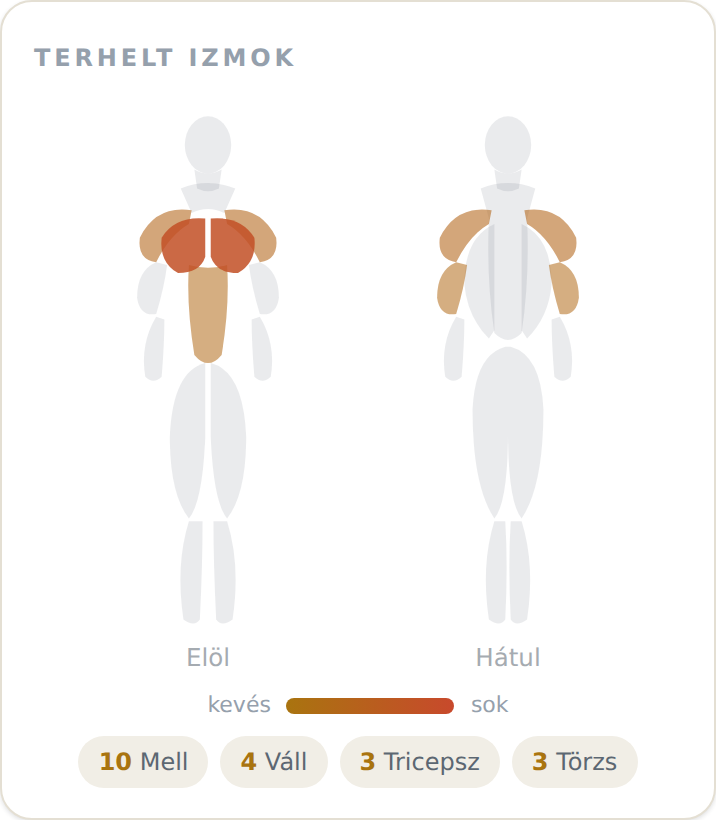

# Edzésnapló

Egykezes, telefonra szánt push/pull edzésnapló – teremben, edzés közben,
izzadt ujjal is kényelmesen használható. A hangsúly a gyorsaságon van: a
szett-rögzítés két koppintás, minden gomb nagy, a súly és az ismétlés
nagy, jól olvasható számokkal jelenik meg.

A teljes alkalmazás **egyetlen HTML-fájl**, build és futásidejű függőség
nélkül. Telepíthető PWA, offline is működik, és opcionálisan felhő-fiókkal
több eszköz közt szinkronizál.

**Élő verzió:** https://albi012.github.io/spartaiak/

## Képernyőképek

<table>
  <tr>
    <td align="center" width="33%"><br><sub>Főképernyő – „Mit edzek ma?"</sub></td>
    <td align="center" width="33%"><br><sub>Vezetett edzés</sub></td>
    <td align="center" width="33%"><br><sub>Izomtérkép az összegzőben</sub></td>
  </tr>
</table>

---

## Mit tud

**Edzés és naplózás**
- Vezetett lejátszó: a kezdőképernyő a mai edzést kínálja, pihenőórával és
  súlyállítóval; a szettek két koppintással rögzülnek.
- Egy megkezdett edzés minden rögzített szettje azonnal mentődik – ha
  véletlen bezárul az app, újranyitva a „Folytatás" kártyáról ott lehet
  folytatni, ahol abbamaradt.
- Superset / kör: saját edzésben gyakorlatok összeköthetők – a tagok közt
  rövid váltás, a teljes pihenő a kör végén.
- Idő-alapú gyakorlatnál (plank stb.) beépített visszaszámláló óra, ami a
  végén rögzíti a tartott másodperceket.
- A pihenő a képernyőt ébren tartja; opcionálisan a hátralévő idő rendszer-
  értesítésben is látszik, ha közben kiváltasz az appból.
- Befejezés-összegző: időtartam, gyakorlat- és szettszám, összterhelés,
  új csúcsok (PR), és egy elöl+hátul izomtérkép a terhelt izmokkal.
- Napló: minden edzés visszanézhető (dátum, időtartam, szettek,
  összterhelés), hónapokra bontva, lenyitható izomtérképpel.

**Saját tervek**
- Beépített 4 napos terv (Push A / Pull A / Push B / Pull B).
- Saját gyakorlatok, saját edzések és több napból álló edzéstervek
  összeállíthatók az appon belül; kész sablonok is választhatók.
- Beépített gyakorlat-könyvtár (~160 gyakorlat), izomcsoportra szűrhető
  választóval.
- Bemelegítő-szett javaslat: a munkasúlyból automatikus lépcsők +
  oldalankénti tárcsakiosztás.
- Gyakorlatonkénti „Technika videó" link (külső fülön nyílik).

**Haladás**
- Összegző számok: összes edzés, e havi, hetes sorozat, össztömeg; szint /
  XP (streak-fókuszú).
- Edzésnaptár-heatmap az utolsó 16 hétről; havi aktivitás; a legtöbbet
  fejlődő gyakorlatok.
- Heti **izomtérkép**: elöl+hátul figura, a terhelt izmok folytonos
  hőskálával színezve, és a héten kimaradt izomcsoportok kiemelése.
- Gyakorlatonkénti trend nagy grafikonnal, teljes előzménnyel és a
  csúccsal (PR); váltható munkasúly / térfogat / becsült 1RM között.

**Edző-funkciók**
- Okos súlyjavaslat: a túlteljesítés arányában nagyobbat lép; hosszabb
  kihagyás után visszaépítést ajánl. Választható progressziós szabályok.
- „Mit edzek ma?": a heti izomtérkép hiányait lefedő edzésnapot ajánlja.
- Sérülés-mód: az érintett testtájak gyakorlatai kimaradnak, a többi súlya
  csökken.
- Kétszintű jegyzet (állandó gyakorlat-jegyzet + aznapi) és
  gépbeállítás-fotó gyakorlatonként.
- Tárcsa-kalkulátor: edzés közben a súlyra koppintva megmutatja, mennyi
  tárcsát kell felrakni oldalanként.
- Heti összefoglaló: az elmúlt hét edzéseit olvasható szöveggé alakítja,
  amit el lehet küldeni egy (AI-)edzőnek.

**Gyógytorna / mobilitás**
- Külön oldal (a felső sáv állandó ikonjáról): testtájankénti
  mobilitás-, nyújtó- és stabilizáló gyakorlatok technikai emlékeztetővel
  és videó-linkkel – *referencia, nem orvosi tanács*.
- Testtájankénti **5 perces vezetett rutin** egy koppintással (a tartásokat
  óra méri); ez nem naplózódik, nem befolyásolja a statokat.

**Fiók, szinkron és barátok** *(opcionális)*
- E-mail + jelszavas **regisztráció és belépés** – pár másodperc, a fiók
  ott helyben, az appban létrehozható. Fiók nélkül is minden működik, csak
  lokálisan.
- Belépve a felhő nem felülír, hanem **összefésül** a helyi naplóval, így
  két eszköz közt egyetlen rögzített edzés sem vész el.
- Barát-kóddal barátjelölés, megosztott statok és edzéstervek.

**Megjelenés**
- Világos/sötét téma (rendszerkövetéssel és kézi váltóval); a sötét az
  alapértelmezett, teremben kényelmesebb.

---

## Kipróbálás

A leggyorsabb az élő verzió megnyitása telefonon és **hozzáadása a
kezdőképernyőhöz** – onnantól teljes képernyős appként, offline is fut:

https://albi012.github.io/spartaiak/

Helyben egy egyszerű statikus szerverrel is futtatható:

```bash
git clone https://github.com/albi012/spartaiak
cd spartaiak
python3 -m http.server 8000
# majd: http://localhost:8000
```

Nincs telepítendő függőség és nincs build lépés – a repó egy statikus
oldal.

---

## Adat és adatvédelem

- Az edzésadat a **böngésződben** marad (`localStorage`); az app
  alapból semmit nem küld el sehová.
- Nincs benne követés, reklám vagy analitika.
- A Napló fülről egy koppintással exportálható és visszaállítható az egész
  napló JSON-ként.
- A felhő-szinkron opcionális: csak akkor lép működésbe, ha beállítasz egy
  saját [Supabase](https://supabase.com) projektet és bejelentkezel. Az
  adatot ekkor is veszteségmentesen fésüli össze, és a törlés egy másik
  eszközön sem „támad fel".

---

## Hogyan épül fel

- Vanilla JavaScript, keretrendszer nélkül; az egész UI és logika az
  `index.html`-ben.
- PWA: `manifest.webmanifest` + `sw.js` service worker az offline
  működéshez; ikonok a kezdőképernyőhöz.
- Opcionális felhő-réteg: `js/auth.js` + Supabase (Auth + Postgres az
  `supabase/` alatti sémákkal). Konfiguráció nélkül az app tisztán
  lokálisan fut.
- Deploy: GitHub Pages (a `main` minden pushnál automatikusan publikál a
  `.github/workflows/pages.yml` révén). A repóban lévő `netlify.toml`
  alternatív Netlify-deployt is lehetővé tesz.
- Tesztek a `test/` alatt: `merge-test.html` (a felhő-összefésülés
  regressziói, böngészőben), és `e2e.mjs` (Playwright – a teljes
  felhasználói folyamat egy fejlécnélküli böngészőben). Részletek:
  `test/README.md`.

Saját felhő-szinkronhoz: futtasd le a `supabase/*.sql` sémákat egy Supabase
projektben, majd másold a `supabase-config.example.js`-t
`supabase-config.js` néven, és töltsd ki a projekt URL-jével és a
böngésző-biztos *publishable* kulccsal. (A titkos `service_role` kulcs soha
ne kerüljön a kódba – a hozzáférést a táblák Row Level Security szabályai
védik.)

---

## Licenc

Személyes projekt. Ha felhasználnád, nyiss egy issue-t vagy vedd fel a
kapcsolatot a repó tulajdonosával.
